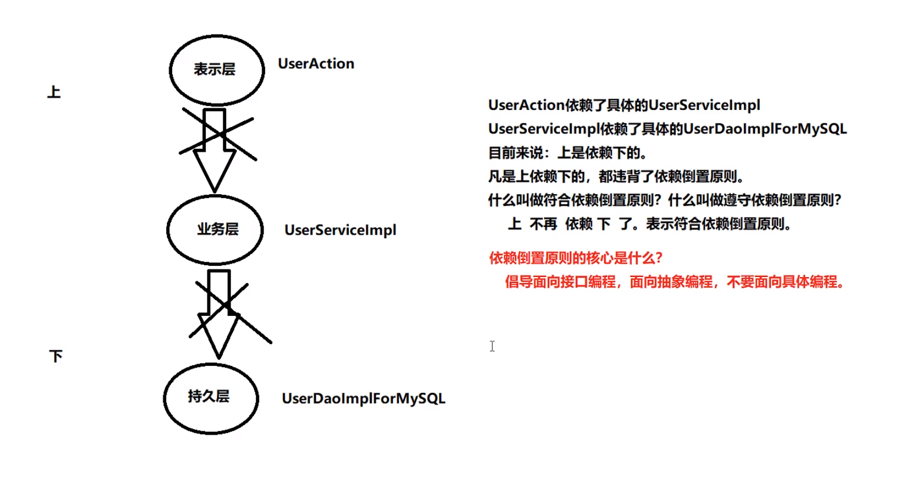
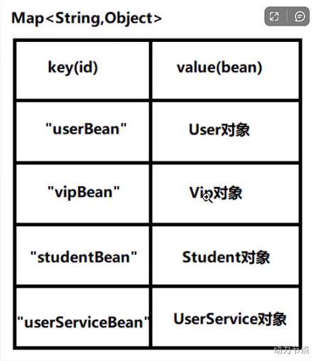
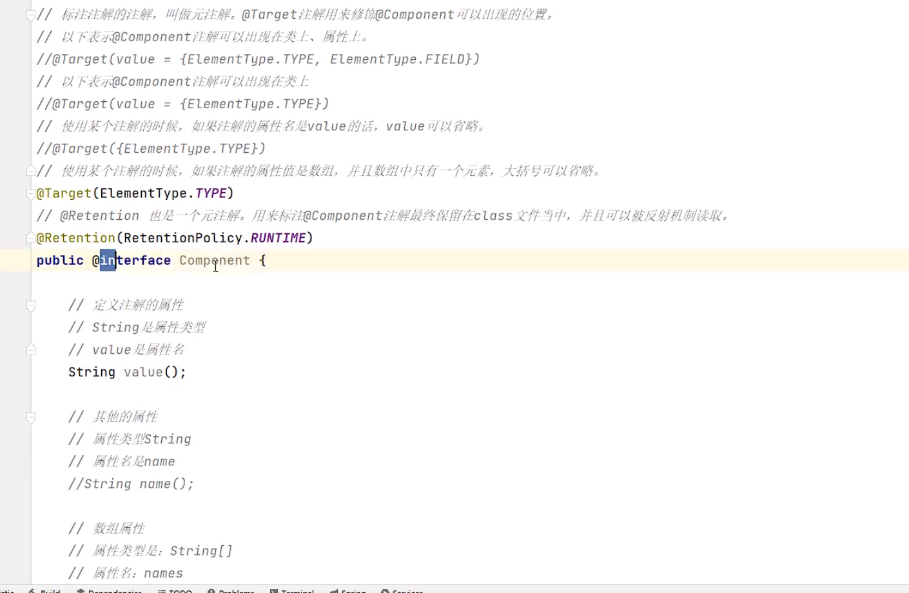
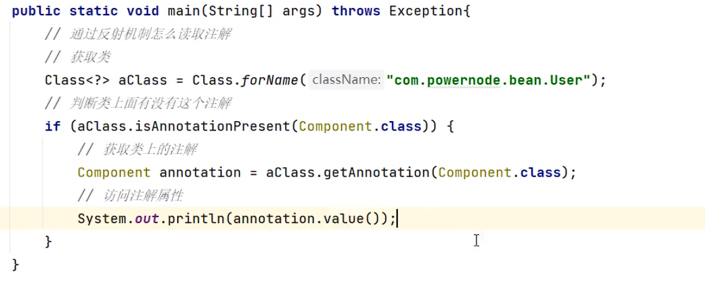
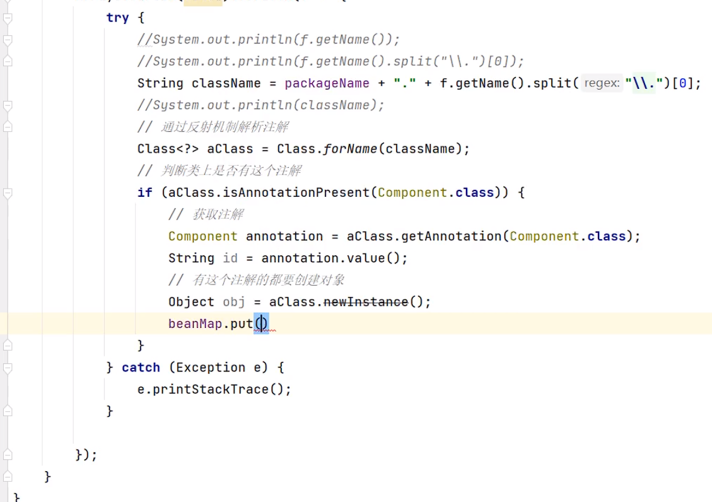
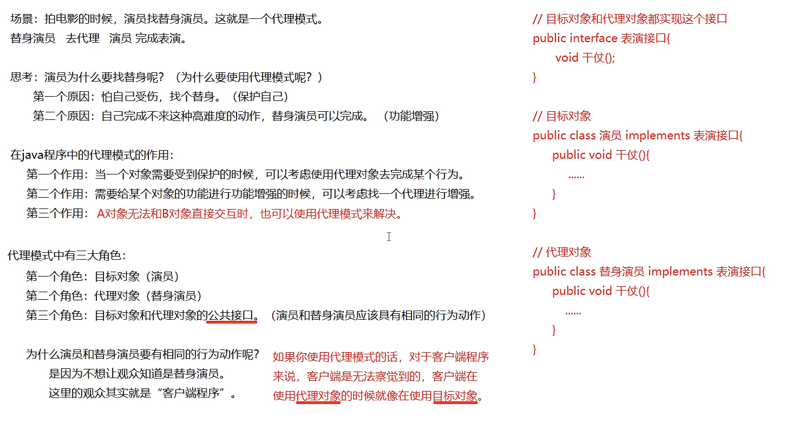
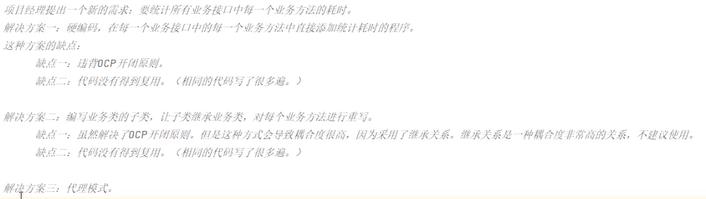
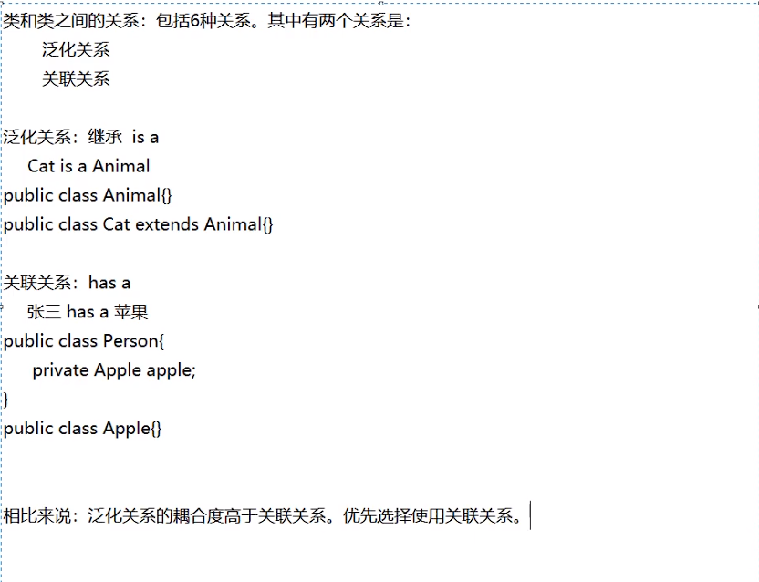
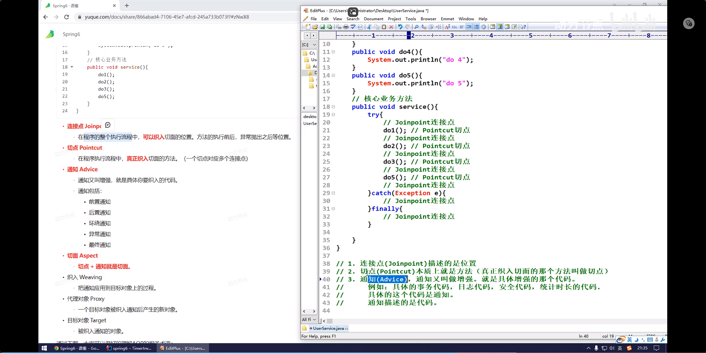

- 轻量级容器
- 是springboot和sprintcloud的基础
- 了解一些编程原则编程思路/从哪里了解/这么了解
- markdown文档怎么写的好看
- Gof23中设计模式/IoC控制反转思想

# 一、Spring启示录

## （一）环境配置

- jdk最低要17 -> 多版本jdk切换和配置
  - 如果17没有jie需要管理员模式切到jdk目录下`bin\jlink.exe --module-path jmods --add-modules java.desktop --output jre`

## （二）当前项目存在的问题

- 向前项目结构：层与层使用接口，servlet里有service对象，service对象里有dao对象。

- 情景/问题：用户一年后有钱了，想要更换其他高性能Oracle数据库。那么dao实现类要重新写，之前程序中所有跟mysql数据库有关的对象要被替换。-> 重新单元测试全部模块项目等等

## （三）软件开发七大原则

- 开闭原则

  1. 什么是0CP?
     OCP是软件七大开发原则当中最基本的一个原则: 开闭原则
     	对什么开?对扩展开放。
     	对什么闭?对修改关闭。

  2. 0CP原则是最核心的，最基本的，其他的六个原则都是为这个原则服务的。
  3. OCP开闭原则的核心是什么?
     	只要你在扩展系统功能的时候，没有修改以前写好的代码，那么你就是符合OCP原则的。
     	反之，如果在扩展系统功能的时候，你修改了之前的代码，那么这个设计是失败的，违背OCP原则。
  4. 当进行系统功能扩展的时候，如果动了之前稳定的程序，修改了之前的程序，之前所有程序都需要进行重新测试。这是不想看到的，因为非常麻烦。

- 依赖倒置原则

  

  1. 什么是依赖倒置原则?
     面向接口编程，面向抽象编程，不要面向具体编程。
  2. 依赖倒置原则的目的?
     降低程序的耦合度，提高扩展力。
  3. 什么叫做符合依赖倒置?
     上 不依赖 下，就是符合。
  4. 什么叫做违背依赖倒置 ?
     上 依赖 下，就是违背。
     只要"下”一改动，“上"就受到牵连。

## （四）当前程序的设计,显然既违背OCP,又违背DIP,怎么办

- 可以采用"控制反转"这种编程思想来解决这个问题

- 这种思想的最直观体现在, userDao和userService属性不在直接new

  ```java
  public class UserServiceImpl implements UserService {
      private UserDaoImpl userDao;
  
      public int deleteUser() {
          //删除用户的业务
          UserDao userDao = new UserDaoImpl();
          userDao.deleteById();
          return 0;
      }
  }
  public class UserAction {
      private UserService userService;
  
      public void deleteRequest() {
          //调用service的删除业务
  
          userService.deleteUser();
      }
  }
  ```

## （五）什么是控制反转

- 控制反转: IoC (Inversion of Control)
- 反转是什么呢?
  - 反转的是两件事:
    - 第一件事: 我不在程序中采用硬编码的方式来new对象了。 (new对象我不管了，new对象的权利交出去了。)
    - 第二件事: 我不在程序中采用硬编码的方式来维护对象的关系了。(对象之间关系的维护权，我也不管了，交出去了。)
- 控制反转:是一种编程思想。或者叫做一种新型的设计模式。由于出现的比较新，没有被纳入G0F23种设计模式范围内。

## （六）由此引出Spring框架

- Spring框架实现了控制反转IOC这种思想
  - Spring框架可以帮你new对象。
  - Spring框架可以帮你维护对象和对象之间的关系。
- Spring是一个实现了IoC思想的容器。
- 控制反转的实现方式有多种，其中比较重要的叫做:依赖注入(Dependency Injection，简称DI)
- 控制反转是思想,依赖注入是这种思想的具体实现
- 依赖注入DI，又包括常见的两种方式:
      第一种: set注入(执行set方法给属性赋值)
      第二种: 构造方法注入《执行构造方法给属性赋值)
- 依赖注入 中“依赖”是什么意思? “注入”是什么意思?
      依赖: A对象和B对象的关系。
      注入: 是一种手段，通过这种手段，可以让A对象和B对象产生关系
- 依赖注入: 对象A和对象B之间的关系, 靠注入的手段来维护。而注入包括：set注入和构造注入
- 

# 二、Spring概述

## （一）八大模块

## （二）Spring特点

- 非侵入式和侵入式：你开发的api/框架，需要依赖别人的api/框架才能单元测试，这样是侵入式的设计
- 每一个被spring容器管理的对象，都叫bean

# 三、Spring的入门程序

下载spring

重要的jar文件 看讲义里的表格

## 3.1 第一个Spring程序的步骤

1. 创建moudle

2. 引入依赖

   ```xml
   <!-- https://mvnrepository.com/artifact/org.springframework/spring-context -->
   <dependency>
       <groupId>org.springframework</groupId>
       <artifactId>spring-context</artifactId>
       <version>6.0.0</version>
   </dependency>
   ```

3. 配置xml

   ```xml
   <?xml version="1.0" encoding="UTF-8"?>
   <beans xmlns="http://www.springframework.org/schema/beans"
          xmlns:xsi="http://www.w3.org/2001/XMLSchema-instance"
          xsi:schemaLocation="http://www.springframework.org/schema/beans http://www.springframework.org/schema/beans/spring-beans.xsd">
       <!--这就是Spring的配置文件-->
       <!--IDEA工具为我们供了这个文件的模板，一定要使用这个模板来创建。-->
       <!--这个文件名不一定叫做spring.xml，可以是其它名字。-->
       <!-- 这个文件最好是放在类路径当中，方便后期的移植。-->
       <!--放在resources根目录下，就相当于是放到了类的根路径下。-->
       <!--配置bean，这样spring才可以帮助我们管理这个对象。-->
   
       <!--
           bean标签的两个重要属性:
               id:是这bean的身份证号，不能重复，是唯一的标识
               cLass: 必须填写类的全路径，全限定类名。 (带包名的类名)
       -->
       <bean id="userBean" class="bean.User"/>
       <bean id="userDaoBean" class="dao.UserDaoImplForMySQL"/>
   </beans>
   ```

4. 编写程序

   ```java
   @Test
   public void testFirstSpringCode(){
       // 第一步:获取Spring容器对象。
       // ApplicationContext 翻译为:应用上下文。其实就是Spring容器
       // ApplicationContext 是一个接口。
       // ApplicationContext 接口下有很多实现类。其中有一个实现类叫做: CLassPathXmlApplicationContext
       // ClassPathXmlApplicationContext 专门从类路径当中加spring配置文件的一个Spring上下文对象。
       // 这行代码只要执行:就相当于启动了Spring容器，解析spring.xml文件，并且实例化所有的bean对象，放到spring容器当中。
       ApplicationContext applicationContext = new ClassPathXmlApplicationContext("spring.xml");
   
       // 第二步 根据bean和id从spring容器中获取这个对象
       Object obj = applicationContext.getBean("userDaoBean");
       System.out.println(obj);
   }
   ```

## 3.2 第一个程序的小细节

1. bean的id能不能重复？
   - 不能

2. spring是怎么实例化对象的？
   - 默认是会通过反射机制，调用类的无参构造器来实例化对象

3. 把创建好的对象存储到一个什么样的数据结构当中了？
   - 
   - spring.xml可以看成一个map集合, id就是key, value是通过反射创建后的对象

4. spring6.xml配置文件必须叫spring6吗？
   - 不是必须的

5. spring配置文件可以多个吗？
   - 可以, 例ClassPathXmlApplicationContext("spring.xml", "beans.xml", "xml/beans.xml")

6. 在配置文件中的配置的类必须是自定义的? 可以使用jdk中的类吗? 例如java.util.Date
   - 可以

7. getBean("这里id写错了,是返回null还是报错?")
   - 不返回null, 而是报错

8. getBean("nowTime")返回的是Object, 可以不使用强转吗?

   - 可以,使用第二个参数指定返回的bean类型

   - getBean("nowTime", Date.class) -> Date类型

9. 如果spring配置文件不在类的根路径, 如何加载?

   - ClassPathXmlApplicationContext("d:/spring.xml")

10. 关于BeanFactory

    - ApplicationContext接口的超级父接口是: BeanFactory(翻译为Bean工厂，就是能够生产Bean对象的一个工厂对象。)

    - BeanFactory是IoC容器的顶级接口。
    - Spring的IoC容器底层实际上使用了:工厂模式
    - Spring底层的IOC是怎么实现的?XML解析 + 工厂模式 + 反射机制

11. 注意: 不是在调用getBean()方法的时候创建对象, 执行以下代码的时候就会实例化对象

    - ```java
      new ClassPathXmlApplicationContext("spring6.xml");
      ```

## 3.3 开启Log4j2日志

从Spring5之后，Spring框架支持集成的日志框架是Log4j2.如何启用日志框架：

第一步：引入Log4j2的依赖

```xml
<!--log4j2的依赖-->
<dependency>
  <groupId>org.apache.logging.log4j</groupId>
  <artifactId>log4j-core</artifactId>
  <version>2.19.0</version>
</dependency>
<dependency>
  <groupId>org.apache.logging.log4j</groupId>
  <artifactId>log4j-slf4j2-impl</artifactId>
  <version>2.19.0</version>
</dependency>
```

第二步：在类的根路径下提供log4j2.xml配置文件（文件名固定为：log4j2.xml，文件必须放到类根路径下。）

```xml
<?xml version="1.0" encoding="UTF-8"?>

<configuration>

    <loggers>
        <!--
            level指定日志级别，从低到高的优先级：
                ALL < TRACE < DEBUG < INFO < WARN < ERROR < FATAL < OFF
        -->
        <root level="DEBUG">
            <appender-ref ref="spring6log"/>
        </root>
    </loggers>

    <appenders>
        <!--输出日志信息到控制台-->
        <console name="spring6log" target="SYSTEM_OUT">
            <!--控制日志输出的格式-->
            <PatternLayout pattern="%d{yyyy-MM-dd HH:mm:ss SSS} [%t] %-3level %logger{1024} - %msg%n"/>
        </console>
    </appenders>

</configuration>
```

第三步：使用日志框架

```java
//第一步创建日志记录器对象
//获取TestFirstSpring类的日志记录器对象, 就是说只要是这个类中的代码执行记录日志的话,就输出相关的日志信息
Logger logger = LoggerFactory.getLogger(FirstSpringTest.class);
//第二步 记录日志,根据不同的级别来输出日志
logger.info("我是一条日志消息");
logger.debug("我是一条调试信息");
logge
```

# 四、spring对IoC的实现

## （一）控制反转

控制反转是一种思想，依赖注入是实现控制反转的方式，其是为了降低程序的耦合度，提高拓展力（OCP原则和DIP原则）

spring这个框架是用来帮你完成以下两件事的

- 创建对象
- 维护对象和对象之间关系

## （二） 依赖注入

依赖是对象和对象之间的关系，注入就是通过赋值让对象产生关系

前面学习的第一个spring程序，只是通过spring来创建一个对象

但是对象有属性啊，这怎么办？怎么通过spring给对象赋值？

### 1. set注入

可以使用set注入，来完成对对象的属性赋值

前提：一那个属性有set方法，二在bean标签里配置property（name ref）

```xml
<bean id="vipDaoBean" class="dao.VipDao"/>
<!--    配置UserDao-->
<bean id="userDaoBean" class="dao.UserDao"/>
<!--    配置UserService-->
<bean id="userServiceBean" class="service.UserService">
    <!--想让spring调用对应的set方法,需要配置property标签-->
    <!--name: set方法名去掉set,再把首字母小写-->
    <!--ref: 指定要注入的bean的id-->
<!--        <property name="mySQLUserDao" ref="userDaoBean"/>-->
    <property name="userDao" ref="userDaoBean"/>
    <!--测试后得知,这里的name本质上不是写属性名,只是建议和属性名一样->等于写属性名-->
<!--        <property name="abc" ref="vipDaoBean"/>-->
</bean>
```

小结`property`的属性有：

- name属性（set方法名去掉set,再把首字母小写）

- ref属性（指定要注入的bean的id）

实现原理：

- 通过property标签获取到属性名：userDao

- 通过属性名推断出set方法名：setUserDao

- 通过反射机制调用setUserDao()方法给属性赋值

- property标签的name是属性名。

- property标签的ref是要注入的bean对象的id。

### 2. 构造注入

还可以使用构造（器）注入，来完成对对象的属性赋值

前提：

一那个属性要有构造器可以赋值，

二在bean标签里配置constructor-arg（index/name ref）

```xml
<bean id="vipDaoBean" class="dao.VipDao"/>
<bean id="userDaoBean" class="dao.UserDao"/>
<bean id="csBean" class="service.CustomerService">
    <!--构造注入-->
    <!--
        index属性指定参数下标，第一个参数是0，第二个参数是1，第三个参数是2，以此类推。顺序无所谓
        ref属性用来指定注入的bean的id
    -->
    <!--指定构造方法的第一个参数,下表是0-->
    <constructor-arg index="0" ref="userDaoBean"/>
    <!--指定构造方法的第一个参数,下表是1-->
    <constructor-arg index="1" ref="vipDaoBean"/>
</bean>

<bean id="csBean2" class="service.CustomerService">
    <!--根据构造方法的参数名,注入-->
    <constructor-arg name="userDao" ref="userDaoBean"/>
    <constructor-arg name="vipDao" ref="vipDaoBean"/>
</bean>

<bean id="csBean3" class="service.CustomerService">
    <!--不指定下标,也不指定参数名,让sopring自己做类型匹配-->
    <!--这种方式实际上是根据类型进行注入的,spring会自动根据类型来判断把ref注入给哪个参数-->
    <constructor-arg ref="vipDaoBean"/>
    <constructor-arg ref="userDaoBean"/>
</bean>
```

小结`constructor-arg`可以使用：

- index属性（下标从0开始），

- name属性（类的属性名），

- 不指定下标也不指定参数名（根据类型来判断把ref注入给哪个参数）,

- ref属性（指定要注入的bean的id）

## （三）set注入专题

### 1、注入外部bean和内部bean

外部bean

```xml
<bean id="orderDaoBean" class="dao.OrderDao"/>
<bean id="orderServiceBean" class="service.OrderService">
    <!--使用ref属性来引入.这就是注入外部bean-->
    <property name="orderDao" ref="orderDaoBean"/>
</bean>
```

小结：

- property的ref，指向外面的bean（的id）

内部bean

```xml
<bean id="orderServiceBean2" class="service.OrderService">
    <property name="orderDao">
        <bean class="dao.OrderDao"/>
    </property>
</bean>
```

小结：

- property不写ref="beanId"，是在体内使用bean标签（只写class属性）

### 2、注入简单类型

简单类型有哪些？（BeanUtils -> isSimpleValueType( )）

```java
public static boolean isSimpleValueType(Class<?> type) {
    return Void.class != type && Void.TYPE != type && (ClassUtils.isPrimitiveOrWrapper(type) ||         Enum.class.isAssignableFrom(type) || CharSequence.class.isAssignableFrom(type) || Number.class.isAssignableFrom(type) || Date.class.isAssignableFrom(type) || Temporal.class.isAssignableFrom(type) || 
URI.class == type || 
URL.class == type || 
Locale.class == type || 
Class.class == type);
}
```

总结以上源码可知：

八大基本数据类型及其包装类，枚举，字符串，Date...都是简单类型

`注意`Date虽然被官方说明属于简单类型，但是由于value="外国人的日期格式"才可以直接注入，我们在开发中一般当成非简单类型，使用ref="beanId"注入

```xml
<bean id="svtBean" class="bean.SimpleValueType">
    <!--报错了.说2023-12-3这个字符串无法转换成java.util.Date-->
    <!--<property name="birth" value="2023-12-3"/>-->
    <!--如果你硬要把Date当作简单类型的话,使用value赋值的话,这个日期字符串格式有要求Sun Dec 03 17:38:19 CST 2023-->
    <!--在实际开发中,一般不会把Date当作简单类型,虽然他是简单类型-->
    <property name="birth" value="Sun Dec 03 17:38:19 CST 2023"/>
</bean>
```

#### 简单类型注入的经典应用

```xml
<bean id="myDataSourceBean" class="jdbc.MyDataSource">
    <property name="driver" value="com.mysql.jdbc.driver"/>
    <property name="url" value="mysql://localhost:3306/powernode"/>
    <property name="user" value="root"/>
    <property name="password" value="hsp"/>
</bean>
```

小结：

- 注入简单类型，property使用value属性
- 注入非简单类型，property使用ref属性而不是value

### 3、级联属性赋值

例如：学生类和班级类，学生类的一个属性是班级类的对象

第一种方式，实现级联属性赋值的效果（外部注入）

```xml
<bean id="clazzBean" class="bean.Clazz">
	<property name="name" value="高三一班"/>
</bean>

<bean id="studentBean" class="bean.Student">
    <!--简单类型.使用value-->
    <property name="name" value="张三"/>
    <!--不是简单类型,使用ref-->
    <property name="clazz" ref="clazzBean"/>
</bean>
```

第二种方式，级联属性赋值

```xml
<bean id="clazzBean" class="bean.Clazz">
	<!--<property name="name" value="高三一班"/>-->
</bean>

<bean id="studentBean" class="bean.Student">
    <!--简单类型.使用value-->
    <property name="name" value="张三"/>
    <!--不是简单类型,使用ref-->
    <property name="clazz" ref="clazzBean"/>
    <!--级联属性赋值, 如果要使用,
        1. Student类要有getClazz方法
        2. 顺序不能颠倒,如当前例子所示-->
    <property name="clazz.name" value="高三一班"/>
</bean>
```

其实就是在主类bean里再写一个property，只不过property的name="clazz.name"

级联属性赋值小结：

- 被指向的类要有getXxx方法
- 顺序不能颠倒，被指向的类要先ref（创建后）才能赋值

### 4、注入数组

```xml
<bean id="yuQian" class="bean.QianDaYe">
    <!--注入数组之简单类型-->
    <property name="aiHaos">
        <array>
            <value>抽烟</value>
            <value>喝酒</value>
            <value>吃肥肉</value>
        </array>
    </property>

    <!--注入数组之自定义类型-->
    <property name="girls">
        <array>
            <ref bean="girl1"/>
            <ref bean="girl2"/>
            <ref bean="girl3"/>
        </array>
    </property>
</bean>
```

小结：

- 注入简单类型array里套value，注入自定义类型array里套ref bean=""

- 数组的类型-spring会自动判断类型

### 5、注入List，Set

注入list的用法

```xml
<!--注入list-->
<property name="friends">
    <list>
        <value>张三</value>
        <value>李四</value>
        <value>王五</value>
        <value>王五</value>
        <value>王五</value>
        <value>王五</value>
    </list>
</property>
```

注入set类型的数据

```xml
<!--注入map-->
<property name="addrs">
    <set>
        <value>北京</value>
        <value>上海</value>
        <value>深圳</value>
        <value>深圳</value>
        <value>深圳</value>
    </set>
</property>
```

### 6、注入Map，Properties

注入map

```xml
<!--注入map-->
<property name="phones">
    <map>
        <!--如果key或者value是非简单类型的,使用key-ref或者value-ref-->
        <entry key="110" value="报警电话"/>
        <entry key="120" value="急救电话"/>
        <entry key="119" value="火警电话"/>
    </map>
</property>
```

注入Properties（底层是map，key和value都是String）

```xml
<!--注入Properties-->
<property name="properties">
    <props>
        <prop key="driver">com.mysql.jdbc.driver</prop>
        <prop key="url">mysql://localhost:3306/powernode</prop>
        <prop key="user">root</prop>
        <prop key="password">hsp</prop>
    </props>
</property>
```

### 7、注入null和空字符串

注入null和空字符串

```xml
<bean id="catBean" class="bean.Cat">
    <!--如果不对属性赋值,属性默认就是空-->
<!--        <property name="name" value="tom"/>-->
    <!--如果写null,相当于把null当做字符串传入了-->
<!--        <property name="name" value="null"/>-->
    <!--如果要手动赋空, 使用null标签-->
<!--        <property name="name">-->
<!--            <null/>-->
<!--        </property>-->

    <!--注入空字符串,value不写内容,自动是空字符串-->
<!--        <property name="name" value=""/>-->
    <!--手动注入空字符串-->
    <property name="name">
        <value/>
    </property>
    <property name="age" value="2"/>
</bean>
```

小结：

- 如果不对属性赋值,属性默认就是空
- 如果写value="null",相当于把null当做字符串传入了
- 如果要手动赋空, 使用null标签`<null/>`
- 注入空字符串, value不写内容,自动是空字符串
- 手动注入空字符串`<value/>`

### 8、注入特殊字符

注入特殊字符

```xml
<bean id="myMathBean" class="bean.MyMath">
    <!--第一种方案使用实体符号代替-->
	<!--<property name="result" value="2 < 3"/>-->
	<!--<property name="result" value="2 &lt; 3"/>-->

    <!--第二种方案使用<![CDATA[]]>-->
    <!--只能用value标签-->
    <property name="result">
        <value><![CDATA[2 < 3]]></value>
    </property>
</bean>
```

### 9、基于命名空间p的注入

底层还是用set方法->简化set注入

`前提`是属性必须有set方法

```xml
<?xml version="1.0" encoding="UTF-8"?>
<beans xmlns="http://www.springframework.org/schema/beans"
       xmlns:xsi="http://www.w3.org/2001/XMLSchema-instance"
       xmlns:p="http://www.springframework.org/schema/p"
       xsi:schemaLocation="http://www.springframework.org/schema/beans http://www.springframework.org/schema/beans/spring-beans.xsd">
    <!--
        第一步,开启p命名空间xmlns:p="http://www.springframework.org/schema/p"
        第二步,bean中使用p:xx="要注入的值/beanId"
    -->
    <bean id="dogBean" class="bean.Dog" p:name="小花" p:age="2" p:birth-ref="birthBean"/>
    <!--获取当前系统时间-->
    <bean id="birthBean" class="java.util.Date"/>
</beans>
```

### 10、基于命名空间c的注入

底层调用构造器->简化构造器注入

`前提`是属性必须有构造器

```xml
<?xml version="1.0" encoding="UTF-8"?>
<beans xmlns="http://www.springframework.org/schema/beans"
       xmlns:xsi="http://www.w3.org/2001/XMLSchema-instance"
       xmlns:c="http://www.springframework.org/schema/c"
       xsi:schemaLocation="http://www.springframework.org/schema/beans http://www.springframework.org/schema/beans/spring-beans.xsd">

    <!--
        第一步,开启c命名空间xmlns:c="http://www.springframework.org/schema/c"
        第二步,使用下标/参数名 ,可以使用非简单类型
			  (bean中使用c:[_0|xx]="要注入的值/beanId")
    -->
<!--    <bean id="peopleBean" class="bean.People" c:_0="homo" c:_1="20" c:_2="false"/>-->
    <bean id="peopleBean" class="bean.People" c:name="LGBT" c:age="20" c:sex="false"/>
</beans>
```

### 11、util命名空间

是为了让配置复用

```xml
<?xml version="1.0" encoding="UTF-8"?>
<beans xmlns="http://www.springframework.org/schema/beans"
       xmlns:util="http://www.springframework.org/schema/util"
       xmlns:xsi="http://www.w3.org/2001/XMLSchema-instance"
       xsi:schemaLocation="http://www.springframework.org/schema/beans http://www.springframework.org/schema/beans/spring-beans.xsd
                           http://www.springframework.org/schema/util http://www.springframework.org/schema/util/spring-util.xsd">
    <!--开启util命名空间
        第一步:
            xmlns:util="http://www.springframework.org/schema/util"
            http://www.springframework.org/schema/util http://www.springframework.org/schema/util/spring-util.xsd
        第二步
            进行复用
    -->
    <util:properties id="prop">
        <prop key="driver">com.mysql.jdbc.driver</prop>
        <prop key="url">jdbc:mysql://localhost:3306/spring6</prop>
        <prop key="user">root</prop>
        <prop key="password">hsp</prop>
    </util:properties>

    <bean id="mds1" class="jdbc.MyDataSource1">
        <!--进行复用-->
        <property name="properties" ref="prop"/>
    </bean>

    <bean id="mds2" class="jdbc.MyDataSource2">
        <!--进行复用-->
        <property name="properties" ref="prop"/>
    </bean>
</beans>
```

### 12、基于xml的自动装配byName

```xml
<!--根据名字进行自动装配-->
    <!--自动装配也是基于set方式实现的-->
    <bean id="orderServiceBean" class="service.OrderService" autowire="byName"/>
    <!--根据名字进行自动装配的时候,被注入的对象的bean的id就不能随便写了,怎么写? set方法的方法名取掉set,剩下单词首字母小写
-->
    <bean id="orderDao" class="dao.OrderDao"/>

    <!--<bean id="orderDaoBean" class="dao.OrderDao"/>-->
    <!--<bean id="orderServiceBean" class="service.OrderService">-->
    <!--<property name="orderDao" ref="orderDaoBean"/>-->
    <!--</bean>-->
```

OrderService有一个orderDao的属性，spring会自动找id为orderDao的bean，注入到orderDao属性中

### 13、基于xml的自动装配byType

```xml
<!--根据类型进行自动装配-->
<!--
根据类型进行自动装配的时候, 在有效的配置文件当中,某种类型的实例只能有一个-->
<bean class="dao.UserDao"/>
<bean class="dao.VipDao"/>
<bean id="cs" class="service.CustomerService" autowire="byType"/>
```

CustomerService有两个属性userDao和vipDao，待注入的属性类型是dao.UserDao和dao.VipDao，spring会在bean中找类型是以上的类型各一个，自动注入到对应类型的属性上

### 14、引入外部的属性配置文件

是为了让配置更好复用和修改

```xml
<?xml version="1.0" encoding="UTF-8"?>
<beans xmlns="http://www.springframework.org/schema/beans"
       xmlns:xsi="http://www.w3.org/2001/XMLSchema-instance"
       xmlns:context="http://www.springframework.org/schema/context"
       xsi:schemaLocation="http://www.springframework.org/schema/beans http://www.springframework.org/schema/beans/spring-beans.xsd
                           http://www.springframework.org/schema/context http://www.springframework.org/schema/context/spring-context.xsd">
<!--
    引入外部的properties文件
        第一步:引入context命名空间
            xmlns:context="http://www.springframework.org/schema/context"

        第二步:使用标签context:property-placeholder的location属性来指定属性配置文件的路径
            默认从类的根路径下加载资源
        第三步: 取值 ${key}
-->
    <context:property-placeholder location="jdbc.properties"/>

    <bean id="ds" class="jdbc.MyDataSource">
        <property name="driver" value="${jdbc.driver}"/>
        <property name="url" value="${jdbc.url}"/>
        <!--有个小瑕疵, username是默认拿当前系统的用户名, 一般会加前缀解决-->
        <property name="user" value="${jdbc.username}"/>
        <property name="password" value="${jdbc.password}"/>
    </bean>
</beans>
```

# 五、bean作用域

加载spring容器的时候会调用配置的`所有bean`的无参构造方法

scope默认都是单例的

```xml
<!--
    scope属性有两个值
    singleton： 如果不写scope的值，默认就是singleton
    prototype： 这个会取消单例，每次都会调用构造方法重新new对象
    还有其他值（需要引入mvc框架依赖：springmvc）
    request：一次请求种一个bean
    session：一次会话一个bean-->
<bean id="sb" class="bean.SpringBean" scope="prototype"/>
```

```java
/**
 * 1. Spring默认情况下是如何管理这个Bean的:
 *      默认情况下Bean是单例的。(单例: singLeton)
 *      在Spring上下文初始化的时候实例化。
 *      每一次调用getBean()方法的时候，都返回那个单例的对象
 * 2.当将bean的scope质性设置为prototype:bean是多例的。
 *      spring上下文初始化的时候，并不会初始化这些prototype的bean。
 *      每一次调用getBean()方法的时候，实例化bean对象。
 *      prototype翻泽为: 原型。
 */
构造方法执行了
bean.SpringBean@d62fe5b
构造方法执行了
bean.SpringBean@49964d75
构造方法执行了
bean.SpringBean@528c868
```

其他scope、自定义scope（ThreadScope一个线程一个bean好像）看讲义

# 六、工厂模式

spring的Ioc实现<=工厂模式+xml解析+反射、

## （一）设计模式和开发原则概述

设计模式是重复问题的模板解决方案

软件开发原则是写软件的原则

设计模式会尽可能往软件开发原则靠

## （二）简单工厂模式

```
设计模式之:简单工厂模式 Simple Factory Pattern

1。 简单工厂模式是工厂方法模式的一种特殊实现，又被称为: 静态工厂方法模式。

2. 简单工厂模式解决什么问题呢?
    优点:客户端程序不需要关心对象的创建细节，需要哪个对象时，只需要向工厂索要即可，初步实现了责任的分离。
        客户端只负责"消费”，工厂负责“生产”。生产和消费分离。

3。简单工厂模式中的角色:
    * 抽象产品角色
    * 具体产品角色
    * 工厂类角色
4. 简单工厂模式的缺点?
    缺点一:假设现在需要扩展一个新的产品，WeaponFactory工厂类的代码是需要修改的，显然违背了OCP原则。
    缺点二:工厂类的责任比较重大，不能出现任何问题，因为这个工厂类负责所有产品的生产，称为全能类，或者有人把它叫做上帝类。
        这个工厂类一旦出问题，整个系统必然全部瘫痪。 (不要把所有鸡蛋放到一个篮子里面哦。)


工厂方法模式可以解决缺点一
```

## （三）工厂方法模式

```
工厂方法模式: Factory Method Pattern

1. 工厂方法模式可以解决简单工厂模式当中的OCP问题。
    怎么解决的?一个工厂对应生产一种产品。
    这样工厂就不是全能类了，不是上帝类了
    另外，也可以符合0CP原则。

2. 工厂方法模式中的角色:
    * 抽象产品角色 Weapon
    * 具体产品角色 Dagger Gun
    * 抽象工厂角色 WeaponFactory
    * 具体工厂角色 DaggerFactory GunFactory

3.工厂方法模式的优点:
    当你扩展一个产品的时候，符合0CP原则，因为只需要添加两个类，一个类是具体产品类，一个类是具体工厂类。都是添加类，没有修改之前的代码，所以符合OCP

4。工厂方法模式的缺点:
    每次增加一个产品时，都需要增加一个具体类和对象实现工厂，使得系统中类的个数成倍增加，
    在一定程度上增加了系统的复杂度，同时也增加了系统具体类的依赖。这并不是什么好事。

//TODO 编写工厂房吗模式的案例

5. 抽象工厂模式可以解决工厂方法模式的缺点
```

## （四）抽象工厂模式


# 七、bean的实例化方式

创建方式

- 第一种 之前写的

- 第二种 简单工厂模式实例化

  具体工厂直接写了静态的get方法，调用方法不需要实例化

- 第三种 工厂方法模式创建bean

  因为具体工厂继承了抽象父类才能调用get方法，调用方法需要实例化

- 第四种 

# 八、bean的生命周期

面试多，开发应用多

要记得：

- [ ] 五七十步
- [ ] 小细节
- [ ] 自己new对象怎么给spring管理

# 九、Bean的循环依赖

- [x] 两单例 + setter
- [x] 两prototype + setter

- [x] singleton prototype + setter

  

- [x] 两单例 + constructor

- [ ] 根源码


# 十、复习反射机制调用方法

# 十一、手写框架

手写框架实现的功能：依赖注入-set注入部分

spring的Ioc实现<=工厂模式+xml解析+反射、

# 十二、注解是开发

自定义注解



反射获取注解



给定一个目录




# 代理模式



 



# 面向切面编程


