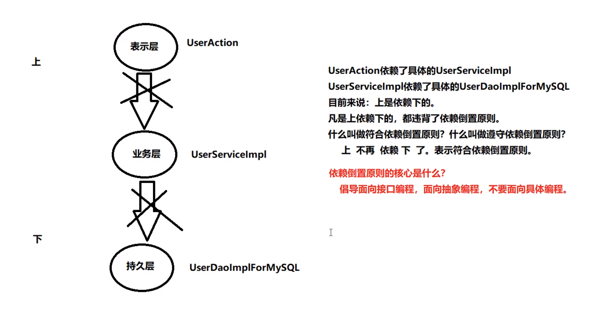
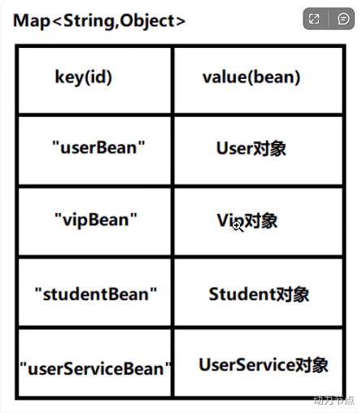

- 轻量级容器
- 是springboot和sprintcloud的基础
- 了解一些编程原则编程思路/从哪里了解/这么了解
- markdown文档怎么写的好看
- Gof23中设计模式/IoC控制反转思想

# 一、Spring启示录

## （一）环境配置

- jdk最低要17 -> 多版本jdk切换和配置
  - 如果17没有jie需要管理员模式切到jdk目录下`bin\jlink.exe --module-path jmods --add-modules java.desktop --output jre`

## （二）当前项目存在的问题

- 向前项目结构：层与层使用接口，servlet里有service对象，service对象里有dao对象。

- 情景/问题：用户一年后有钱了，想要更换其他高性能Oracle数据库。那么dao实现类要重新写，之前程序中所有跟mysql数据库有关的对象要被替换。-> 重新单元测试全部模块项目等等

## （三）软件开发七大原则

- 开闭原则

  1. 什么是0CP?
     OCP是软件七大开发原则当中最基本的一个原则: 开闭原则
     	对什么开?对扩展开放。
     	对什么闭?对修改关闭。

  2. 0CP原则是最核心的，最基本的，其他的六个原则都是为这个原则服务的。
  3. OCP开闭原则的核心是什么?
     	只要你在扩展系统功能的时候，没有修改以前写好的代码，那么你就是符合OCP原则的。
     	反之，如果在扩展系统功能的时候，你修改了之前的代码，那么这个设计是失败的，违背OCP原则。
  4. 当进行系统功能扩展的时候，如果动了之前稳定的程序，修改了之前的程序，之前所有程序都需要进行重新测试。这是不想看到的，因为非常麻烦。

- 依赖倒置原则

  

  1. 什么是依赖倒置原则?
     面向接口编程，面向抽象编程，不要面向具体编程。
  2. 依赖倒置原则的目的?
     降低程序的耦合度，提高扩展力。
  3. 什么叫做符合依赖倒置?
     上 不依赖 下，就是符合。
  4. 什么叫做违背依赖倒置 ?
     上 依赖 下，就是违背。
     只要"下”一改动，“上"就受到牵连。

## （四）当前程序的设计,显然既违背OCP,又违背DIP,怎么办

- 可以采用"控制反转"这种编程思想来解决这个问题

- 这种思想的最直观体现在, userDao和userService属性不在直接new

  ```java
  public class UserServiceImpl implements UserService {
      private UserDaoImpl userDao;
  
      public int deleteUser() {
          //删除用户的业务
          UserDao userDao = new UserDaoImpl();
          userDao.deleteById();
          return 0;
      }
  }
  public class UserAction {
      private UserService userService;
  
      public void deleteRequest() {
          //调用service的删除业务
  
          userService.deleteUser();
      }
  }
  ```

## （五）什么是控制反转

- 控制反转: IoC (Inversion of Control)
- 反转是什么呢?
  - 反转的是两件事:
    - 第一件事: 我不在程序中采用硬编码的方式来new对象了。 (new对象我不管了，new对象的权利交出去了。)
    - 第二件事: 我不在程序中采用硬编码的方式来维护对象的关系了。(对象之间关系的维护权，我也不管了，交出去了。)
- 控制反转:是一种编程思想。或者叫做一种新型的设计模式。由于出现的比较新，没有被纳入G0F23种设计模式范围内。

## （六）由此引出Spring框架

- Spring框架实现了控制反转IOC这种思想
  - Spring框架可以帮你new对象。
  - Spring框架可以帮你维护对象和对象之间的关系。
- Spring是一个实现了IoC思想的容器。
- 控制反转的实现方式有多种，其中比较重要的叫做:依赖注入(Dependency Injection，简称DI)
- 控制反转是思想,依赖注入是这种思想的具体实现
- 依赖注入DI，又包括常见的两种方式:
      第一种: set注入(执行set方法给属性赋值)
      第二种:构造方法注入《执行构造方法给属性赋值)
- 依赖注入 中“依赖”是什么意思? “注入”是什么意思?
      依赖: A对象和B对象的关系。
      注入:是一种手段，通过这种手段，可以让A对象和B对象产生关系
- 依赖注入: 对象A和对象B之间的关系, 靠注入的手段来维护。而注入包括：set注入和构造注入

# 二、Spring概述

## （一）八大模块

## （二）Spring特点

- 非侵入式和侵入式：你开发的api/框架，需要依赖别人的api/框架才能单元测试，这样是侵入式的设计
- 每一个被spring容器管理的对象，都叫bean

# 三、Spring的入门程序

下载spring

重要的jar文件 看讲义里的表格

## 3.1 第一个Spring程序的步骤

1. 创建moudle

2. 引入依赖

   ```xml
   <!-- https://mvnrepository.com/artifact/org.springframework/spring-context -->
   <dependency>
       <groupId>org.springframework</groupId>
       <artifactId>spring-context</artifactId>
       <version>6.0.0</version>
   </dependency>
   ```

3. 配置xml

   ```xml
   <?xml version="1.0" encoding="UTF-8"?>
   <beans xmlns="http://www.springframework.org/schema/beans"
          xmlns:xsi="http://www.w3.org/2001/XMLSchema-instance"
          xsi:schemaLocation="http://www.springframework.org/schema/beans http://www.springframework.org/schema/beans/spring-beans.xsd">
       <!--这就是Spring的配置文件-->
       <!--IDEA工具为我们供了这个文件的模板，一定要使用这个模板来创建。-->
       <!--这个文件名不一定叫做spring.xml，可以是其它名字。-->
       <!-- 这个文件最好是放在类路径当中，方便后期的移植。-->
       <!--放在resources根目录下，就相当于是放到了类的根路径下。-->
       <!--配置bean，这样spring才可以帮助我们管理这个对象。-->
   
       <!--
           bean标签的两个重要属性:
               id:是这bean的身份证号，不能重复，是唯一的标识
               cLass: 必须填写类的全路径，全限定类名。 (带包名的类名)
       -->
       <bean id="userBean" class="bean.User"/>
       <bean id="userDaoBean" class="dao.UserDaoImplForMySQL"/>
   </beans>
   ```

4. 编写程序

   ```java
   @Test
   public void testFirstSpringCode(){
       // 第一步:获取Spring容器对象。
       // ApplicationContext 翻译为:应用上下文。其实就是Spring容器
       // ApplicationContext 是一个接口。
       // ApplicationContext 接口下有很多实现类。其中有一个实现类叫做: CLassPathXmlApplicationContext
       // ClassPathXmlApplicationContext 专门从类路径当中加spring配置文件的一个Spring上下文对象。
       // 这行代码只要执行:就相当于启动了Spring容器，解析spring.xml文件，并且实例化所有的bean对象，放到spring容器当中。
       ApplicationContext applicationContext = new ClassPathXmlApplicationContext("spring.xml");
   
       // 第二步 根据bean和id从spring容器中获取这个对象
       Object obj = applicationContext.getBean("userDaoBean");
       System.out.println(obj);
   }
   ```

## 3.2 第一个程序的小细节

1. bean的id能不能重复？
   - 不能

2. spring是怎么实例化对象的？
   - 默认是会通过反射机制，调用类的无参构造器来实例化对象

3. 把创建好的对象存储到一个什么样的数据结构当中了？
   - 
   - spring.xml可以看成一个map集合, id就是key, value是通过反射创建后的对象

4. spring6.xml配置文件必须叫spring6吗？
   - 不是必须的

5. spring配置文件可以多个吗？
   - 可以, 例ClassPathXmlApplicationContext("spring.xml", "beans.xml", "xml/beans.xml")

6. 在配置文件中的配置的类必须是自定义的? 可以使用jdk中的类吗? 例如java.util.Date
   - 可以

7. getBean("这里id写错了,是返回null还是报错?")
   - 不返回null, 而是报错

8. getBean("nowTime")返回的是Object, 可以不使用强转吗?

   - 可以,使用第二个参数指定返回的bean类型

   - getBean("nowTime", Date.class) -> Date类型

9. 如果spring配置文件不在类的根路径, 如何加载?

   - ClassPathXmlApplicationContext("d:/spring.xml")

10. 关于BeanFactory

    - ApplicationContext接口的超级父接口是: BeanFactory(翻译为Bean工厂，就是能够生产Bean对象的一个工厂对象。)

    - BeanFactory是IoC容器的顶级接口。
    - Spring的IoC容器底层实际上使用了:工厂模式
    - Spring底层的IOC是怎么实现的?XML解析 + 工厂模式 + 反射机制

11. 注意: 不是在调用getBean()方法的时候创建对象, 执行以下代码的时候就会实例化对象

    - ```java
      new ClassPathXmlApplicationContext("spring6.xml");
      ```

## 3.3 开启Log4j2日志

从Spring5之后，Spring框架支持集成的日志框架是Log4j2.如何启用日志框架：

第一步：引入Log4j2的依赖

```xml
<!--log4j2的依赖-->
<dependency>
  <groupId>org.apache.logging.log4j</groupId>
  <artifactId>log4j-core</artifactId>
  <version>2.19.0</version>
</dependency>
<dependency>
  <groupId>org.apache.logging.log4j</groupId>
  <artifactId>log4j-slf4j2-impl</artifactId>
  <version>2.19.0</version>
</dependency>
```

第二步：在类的根路径下提供log4j2.xml配置文件（文件名固定为：log4j2.xml，文件必须放到类根路径下。）

```xml
<?xml version="1.0" encoding="UTF-8"?>

<configuration>

    <loggers>
        <!--
            level指定日志级别，从低到高的优先级：
                ALL < TRACE < DEBUG < INFO < WARN < ERROR < FATAL < OFF
        -->
        <root level="DEBUG">
            <appender-ref ref="spring6log"/>
        </root>
    </loggers>

    <appenders>
        <!--输出日志信息到控制台-->
        <console name="spring6log" target="SYSTEM_OUT">
            <!--控制日志输出的格式-->
            <PatternLayout pattern="%d{yyyy-MM-dd HH:mm:ss SSS} [%t] %-3level %logger{1024} - %msg%n"/>
        </console>
    </appenders>

</configuration>
```

第三步：使用日志框架

```java
//第一步创建日志记录器对象
//获取TestFirstSpring类的日志记录器对象, 就是说只要是这个类中的代码执行记录日志的话,就输出相关的日志信息
Logger logger = LoggerFactory.getLogger(FirstSpringTest.class);
//第二步 记录日志,根据不同的级别来输出日志
logger.info("我是一条日志消息");
logger.debug("我是一条调试信息");
logge
```

# 四、spring对IoC的实现

## 4.1 控制反转

## 4.2 依赖注入

### 4.2.1 set注入

### 4.2.2 构造注入

## 4.3 set注入专题

### 4.3.1 注入外部bean和内部bean

### 4.3.2 注入简单类型

###4.3.3 简单类型有哪些、Date、简单类型注入的经典应用

怎么知道spring里的简单类型？

- BeanUtils -> isSimpleValueType( )

级联属性赋值

注入数组

​	注入简单类型array里套value，注入自定义类型array里套ref bean=""

​	数组的类型-自动判断类型


